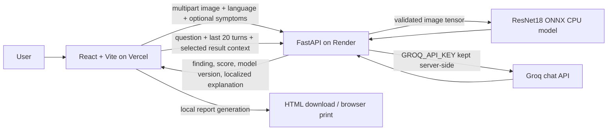

# Architecture

Radiant is a single-page React application backed by a separately hosted FastAPI service. The frontend is served by Vercel; image inference, screening explanations, research metadata, and the Groq proxy run on Render.



## Frontend

Source: `AOML Deploy/radi-ai-buddy-main/radi-ai-buddy-main`.

The Vite React app contains the landing page and imaging workspace. It calls the backend using `VITE_API_BASE_URL`; when unset, development requests target `http://127.0.0.1:8000`. The interface, screening explanation, errors, assistant language, and report labels support English, Hindi, and Marathi.

The session history and uploaded-image object URLs are held in browser memory and cleared when the app session ends; object URLs are revoked when history entries are removed. Language and theme preferences are stored in local storage. Reports are rendered and exported in the browser; the optional patient identity and reviewer fields are not sent to the API.

## Backend

Source: `AOML Deploy/backend/app`.

- `main.py` defines the API routes, request validation, CORS, process-local rate limiting, concurrency control, and privacy headers.
- `predict.py` validates and decodes uploaded images, normalizes them to the model input, applies temperature scaling, and returns an abstaining result when confidence is below 0.8.
- `model.py` loads only the ONNX artifact with its JSON sidecar, verifies its SHA-256 checksum and metadata, and uses ONNX Runtime CPU inference.
- `chatbot.py` calls Groq using a backend-only key. It sends a bounded conversation and, when selected, screening context. There is no local conversational fallback.

The service does not persist uploaded images, symptoms, chat history, or patient details. Model/research aggregate files are read from the deployed package.

## Repository map

```text
README.md                         Project overview and doc links
SECURITY.md                       Dated security assessment
render.yaml                       Render Blueprint for the API
docs/                              Detailed guides
AOML Deploy/backend/
  app/                             API, preprocessing, model, chat
  models/                          Validated ONNX model and metadata
  data/processed/                  Aggregate cleaning summary
  artifacts/                       Aggregate evaluation report
  download_nih.py                  Official NIH release downloader
  clean_nih.py                     Cleaning, leakage checks, EDA
  train.py                         Offline transfer learning/evaluation
AOML Deploy/radi-ai-buddy-main/
  radi-ai-buddy-main/              React + Vite frontend
```

## Request flows

### Screening

1. The browser posts an image, selected language, and optional symptom text to `POST /predict`.
2. The API checks content type, byte size, decoded format, and pixel count.
3. ONNX Runtime returns two logits, temperature scaling produces class scores, and the confidence threshold may return `Uncertain`.
4. The API responds with the finding, score, localized screening explanation, model version, and calibration flag.

### Chat

The browser posts the new question, language, up to 20 prior user/assistant messages, and optional selected-result context to `POST /chat`. The API assembles the system prompt and calls Groq. It does not accept client-provided system/developer roles. Messages are processed by Groq; do not submit information you do not want sent to that provider.

### Report

The report preview and export are client-side. It can summarize the selected screening result or clearly label screening as not performed. HTML download is self-contained; the browser's print dialog can save the report as PDF.
